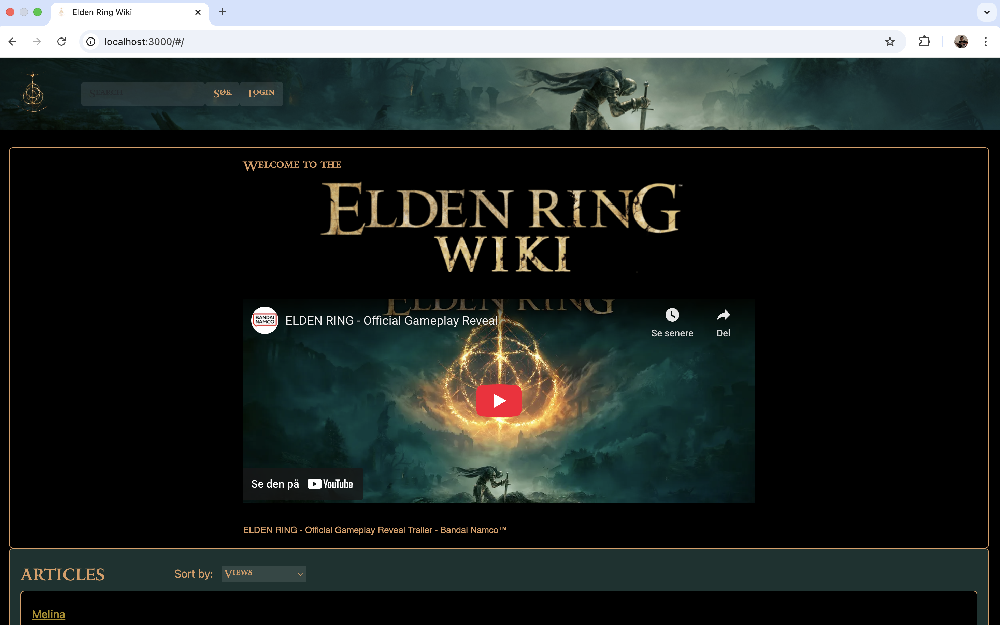
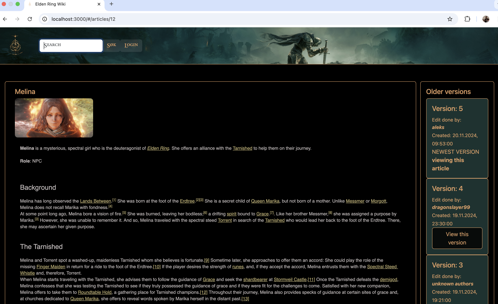
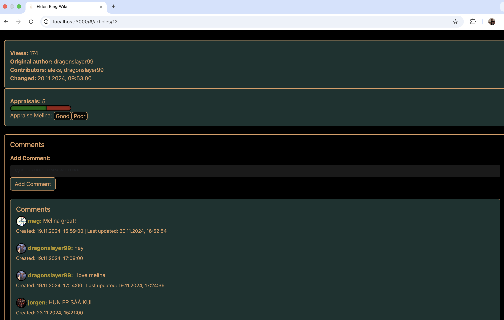

# WikiProject

This is the README-file for the project in DCST2002 - Webutvikling.
We are a team of 5 (Jørgen, Tor Arne, Aleksandrs, Martin og Magnus) and have created a wiki for the popular
game Elden Ring. 

This README will give instructions on how to set up the application as well as give an overview of how we have
been working together. 

## Demo
 
### Video demo on youtube: 

[](https://youtu.be/KJvx_y-m674)

### Picutres: 





### How we work: 

We are using our own GitHub users and are registered as collaborators in this repository. For smaller tasks we have decided to push our code directly to the main branch, while bigger tasks are pushed through branches. Before starting to code we update the repository (git pull). 

Some important changes are controlled before being merged to the main branch.

Our communication during this project was essential. We agreed on a series of protocols to ensure that the collaboration was as effective as possible. 

To do so we first dedicated three communication channels. 
1. A general chat where we discussed general problems and when to meet physically.
2. A chat where we could lock certain files (to minimize merge conflicts).
3. A chat where we informed the group what we had done. 

In addition to being virtually present, the group had a meeting at school each Tuesday where we reflected on the progress and made goals for individual and group performance. Towards the end we had some additional meetings to ensure that the product was finished well within the given deadline. As a group we ensured that every request and question from any group member was heard and taken into careful consideration.


### How to set up the application: 

#### Step 1 - Clone repository
First step is to clone this repository. Copy the code (or the URL) and paste it into your editor (in VS-code you should be using git: clone)

git clone `https://github.com/torabir/WikiProject/`

#### Step 2 - Install node-modules 
Open two terminals and locate the `/client` and `/server` folder. Node-modules are not included in the repository and must be installed according to the standards defined in package.json

##### Terminal 1

```sh
cd EldenRingWiki/Project/client
npm install
```

##### Terminal 2

```sh
cd EldenRingWiki/Project/server
npm install
```

#### Step 3 - Create a datbase 
For this project, you will need your own database. We have created an SQL-script which will help you set up all dependencies, as well as some dummy data. Locate your sql-server and use the files located in 

`Project/DB_setup/dev_DB.sql` and `Project/DB_setup/test_DB.sql`

to create a dev-database (with data) and test-database (for testing). Paste these into an SQL-interpreter. 

##### The alternative
You can access the database directly by using the following username and password (do not abuse)

(removed)

These variables must be pasted into the `config.ts` files (Explained in detail in step 4)


#### Step 4 - Establish a connection to the database
You need to create two configuration files (config.ts) that will contain the database connection details. These contain sensitive information and should never be uploaded to a git-repository.

`server/config.ts`:

```ts
process.env.MYSQL_HOST = 'mysql.stud.ntnu.no' ; // Replace with your host
process.env.MYSQL_USER = ''; //Replace with your own username
process.env.MYSQL_PASSWORD = ''; //Replace with your own password
process.env.MYSQL_DATABASE = ''; //Name from the DB_setup folder
```

`server/test/config.ts`:

```ts
process.env.MYSQL_HOST = 'mysql.stud.ntnu.no' ; // Replace with your host
process.env.MYSQL_USER = ''; //Replace with your own username
process.env.MYSQL_PASSWORD = ''; //Replace with your own password
process.env.MYSQL_DATABASE = ''; //Name from the DB_setup folder
```
These environment variables will be used in the `server/src/mysql-pool.ts` file.

Important: Database username and password was removed post production due to security measures. You will need to have your own database to properly use this website. 

#### Step 5 - Start the application

In each terminal, start the client and server:

##### Terminal 1

```sh
cd EldenRingWiki/Project/client
npm start
```

##### Terminal 2

```sh
cd EldenRingWiki/Project/server
npm start
```

Go to https://localhost:3000/

### How to use the application
This application is quite self-explanatory and we hope that navigating the GUI will be easy to learn and understand. When first booting up the application, you should make a user using the `login` button. Most functions are tied to your user, and the application will inform you that you cannot do these actions without being logged in. 

##### Are you stuck?
You can always click the logo in the top-left corner to return to the home-page and click your name to see your profile. If a button does not seem to work, it could be because our server is slow, so please have some patience:). 

##### Profile: 
In your profile you will find an overview of the articles and comments that you have written. This is also where you can manage your account.

##### Finding conent: 
Navigate the list of articles or use the searchbar to find content. The searchbar allows you to search after tags and the title of the application.

##### Creating content:
To create content, from the homepage, scroll down to the bottom of the page. There you will find the button that helps you create a new article.
You can create an article with a title, image, content and tags. This application supports mark-up language and you can also include links to other articles in the wiki. Just highlight the text that will become a link, and write in a valid API path to a page (ex. / for homepage or /articles/5 for the 5 article). To add the image, just download it to your computer and then upload it to our servers. 

Anyone can comment and give feedback on articles using the comment-section or the appraisal-section at the bottom of the article. 

##### Editing content
On each article-page, there is an edit-button that allows you to change the content. Please be respectful and follow the general theme of the wiki.
A new version of the article will be created and this version will be displayed as the default until a new edit arrives. 

Comments can also be edited or deleted from your profile or by going to the article. 

### AI Statement

Since this project is of pedagogical nature, our focus has been on creating own code and choosing own learning before efficiency. Being developers that understand their code is crucial to our personal development and skillset. 

That being said, we have used several AI-methods in this project to troubleshoot, brainstorm, proofread and scale our code. Some of the repeatable tasks were implemented with this. For pedagogic reasons, we have written comments on sections that were written with the help of AI-assisted tools such as OpenAI.

Our goal with AI is to use it to our advantage, while being the brains of the operation and ensuring that we remain in control.

### Background information
There are several choices made in this wiki that reflect the nature of the Elden-ring game.

1. The appraisal function is non-reversable, so once you have chosen, you cannot go back. This is a reference to the same function within the game. 

2. We have taken some pictures and logo's from the "official" elden-ring wiki https://eldenring.wiki.fextralife.com/Elden+Ring+Wiki 

3. The Alert function is another reference, as they are in the middle of the screen with the same font. Alert.danger() has the same font as when you would see when you die in the game.


### Additional information: 

#### Testing
If you would like to request access to the database, feel free to contact us at magnolan@stud.ntnu.no or send us a private message through any other social-media. Another solution is to copy our database-structure (can be found in DB_setup) and populate it with your own data.

If you would like to run the extensive server and client-side tests that we have provided, go to `../server` (for server tests) and `../client` (for client tests) and run the following script: 

```sh
npm test
```

Our policy was always to test as much as possible, but there are limits to how useful a test is. There is no need to test everything as long at least every aspect is tested once. We concluded that around 60-70% is excellent and sufficient test coverage. 

We hope you enjoy this wiki on Elden Ring!!


Sources:

https://stackoverflow.com/questions/4454839/github-collaboration-using-the-shared-repository-model

https://docs.github.com/en/pull-requests/collaborating-with-pull-requests/getting-started/about-collaborative-development-models

https://chatgpt.com/ 

https://medium.com/@ajlehechka/why-you-should-create-a-github-organization-for-your-side-project-d7c941dbb45b

https://developer.mozilla.org/en-US/docs/Web/API/URLSearchParams

https://reactrouter.com/en/main/hooks/use-location

https://dev.to/vikram-boominathan/search-params-and-use-location-5b7h

https://www.wysiwygwebbuilder.com/ 

https://developer.mozilla.org/en-US/docs/Web/JavaScript/Reference/Global_Objects/Map 

https://fontawesome.com/icons 

https://medium.com/@oshiryaeva offset-vs-cursor-based-pagination-which-is-the-right-choice-for-your-project-e46f65db062f

https://www.youtube.com/watch?v=iRaelG7v0OU&t=2367s

https://www.youtube.com/watch?v=_lZUq39FGv0

https://www.youtube.com/watch?v=MgzVe_MJ7S8

https://developer.mozilla.org/en-US/docs/Web/JavaScript/Reference/Global_Objects/Map 


##### Best wishes; The team, 14.November 2024