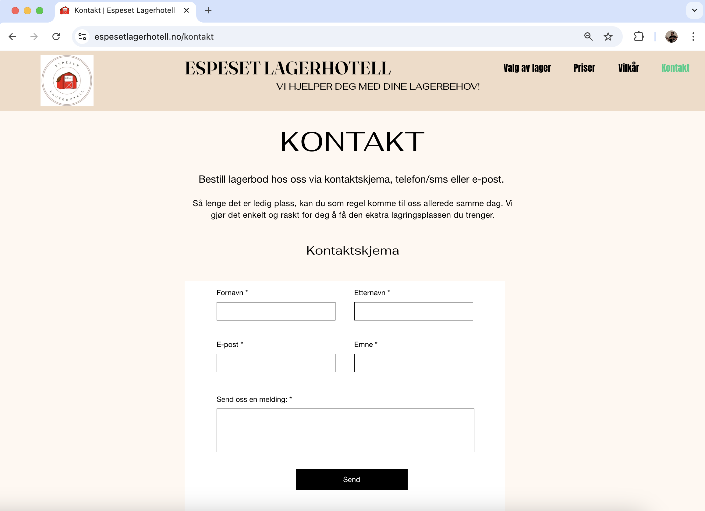
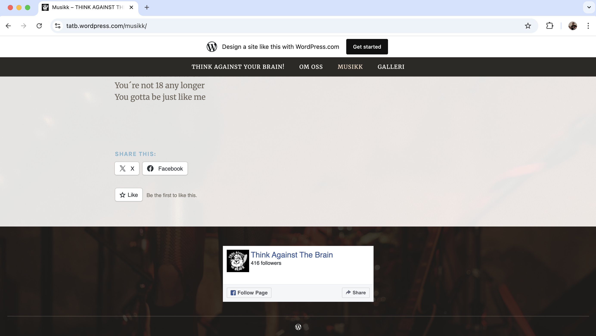
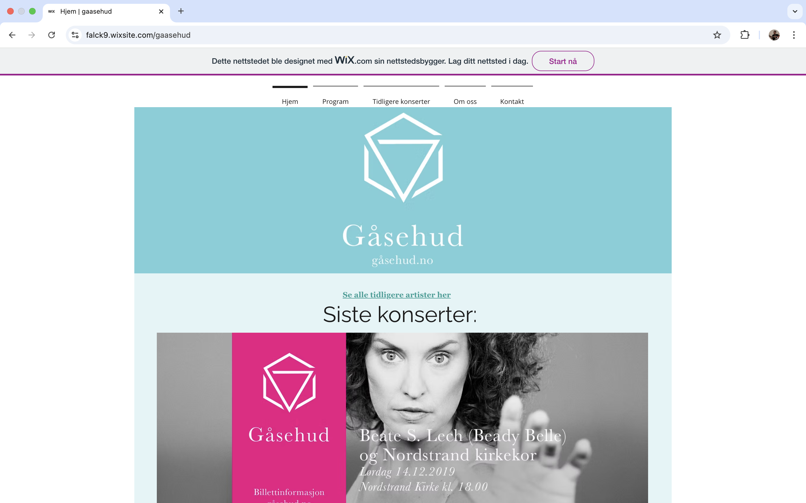
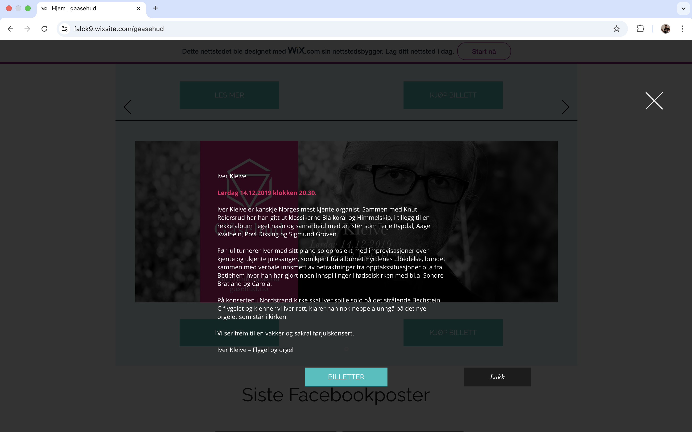
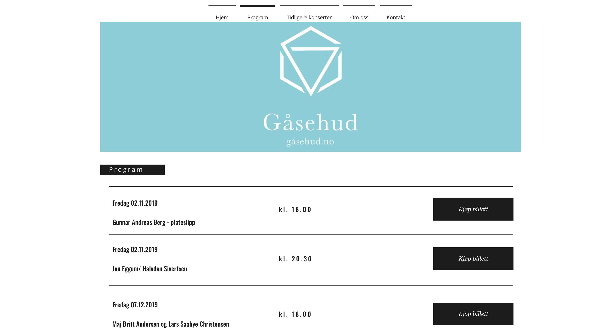

# Overview

### This folder contains a preview of real projects where I’ve built websites for clients using website builders such as Wix and WordPress.

NB! Not all of the websites are currently online or maintained.

The sites were hosted using the website builders’ own hosting services.

# Espeset Lagerhotell

Link: https://espesetlagerhotell.no

A simple business page used to present photos of storage rooms, information about pricing, storage options, location, contact details, and more.

Built with Wix.

# Think Against the Brain - tatb.com

Link: https://tatb.wordpress.com/

An artist page for the punk band Think Against the Brain.

Built with WordPress.

# Gåsehud.no - konsertserie

Link: https://falck9.wixsite.com/gaasehud

Christer Falch produced a concert series at Nordstrand Church featuring beloved Norwegian musicians, including Bjørn Eidsvåg, Odd Nordstoga, and others.

I had the pleasure of creating the website used to share concert information. It was occasionally updated with new lineups.

Built with Wix.

