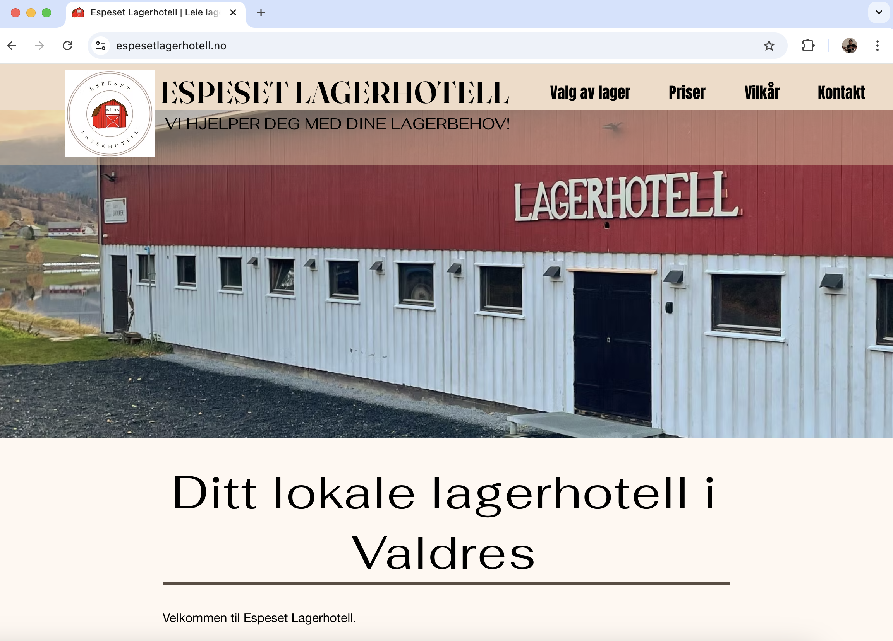
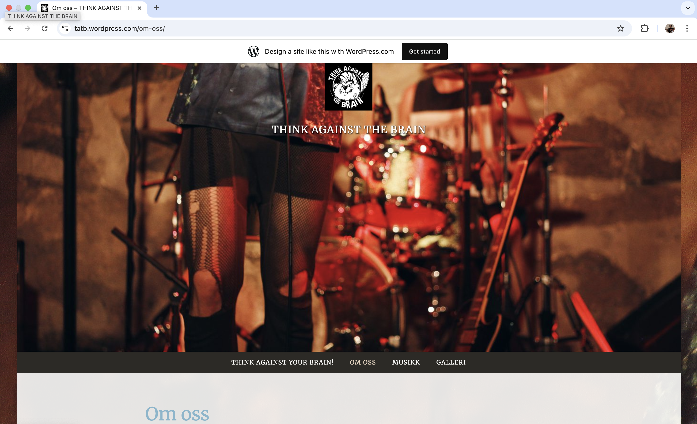

# Overview

### This folder contains real projects where I’ve built websites for clients using website builders such as Wix and WordPress.

Note: Not all of the websites are currently online.

The sites were hosted using the website builders’ own hosting services.

## Espeset Lagerhotell

Link: https://espesetlagerhotell.no

A simple business page used to present photos of storage rooms, information about pricing, storage options, location, contact details, and more. 

Built with Wix.

## Think Against the Brain

Link: https://tatb.wordpress.com/

An artist page for the punk band Think Against the Brain.

Built with WordPress.

## Gåsehud konsertsere

https://gåsehud.no (dead)

Christer Falch produced a concert series at Nordstrand Church featuring beloved Norwegian musicians, including Bjørn Eidsvåg and others.

I had the pleasure of creating the website used to share concert information. It was occasionally updated with new lineups. 

Built with Wix.

Photo 1
Photo 2