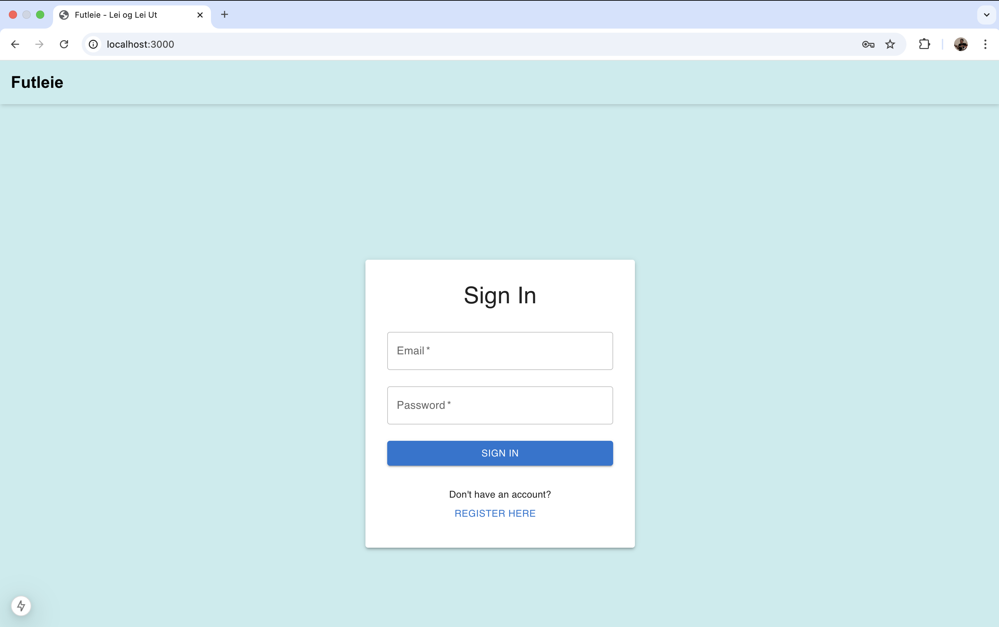
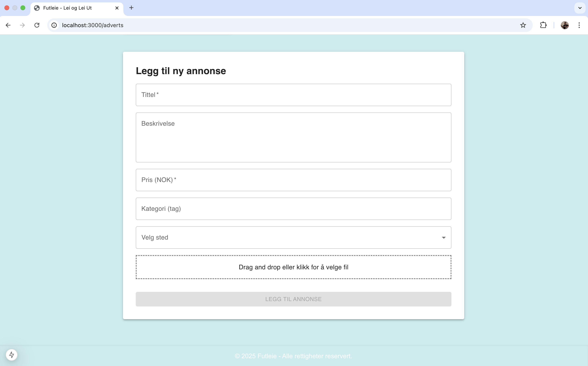
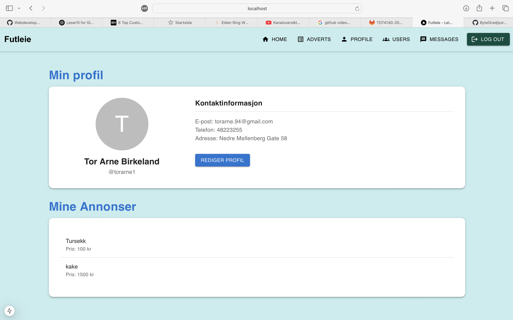

# Futleie

This is the README for our group project in TDT4140 - Software Engineering (Spring 2025).

We were a team of five (Paul, Marie, Amanda, Tor Arne, Pabilan) developing a platform for renting and sharing items like tools, clothes and equipment. The project promotes sustainability through reuse and local sharing.

## Demo pictures

## How we work

We collaborated through GitLab using individual accounts. Smaller tasks were committed directly to the main branch, while larger tasks were developed in feature branches and merged when completed. We coordinated work with git pull before starting new sessions to avoid conflicts.

The main goal of the project was to gain experience with agile software development, specifically Scrum. We practiced core Scrum elements such as sprint planning, daily communication, retrospectives, and backlog prioritization. We also used pair programming on complex tasks to improve code quality and team learning.

Our team met weekly in person and used online chat channels to communicate effectively. One channel was for general discussion and scheduling, another for file coordination (to prevent merge conflicts), and a third for tracking progress. Toward the end of the project, we had additional meetings to finalize development and ensure timely delivery.

## How to run the application

cd futleie/frontend/futleie-app

npm install

npm run dev

Visit: http://localhost:3000

## Additional notes

This project is still in development. 

The project was originally developed in GitLab. As of April 15th, 2025, it has been cloned to GitHub. All further commits from that point onward are made solely by Tor Arne Birkeland.